# Pablo Calderón de Alba 👋

  

  <h3>Administrador de Sistemas Informáticos en Red </h3>

---

### Sobre mí

Titulado en **ASIR** (Administración de Sistemas Informáticos en Red) formándome en **Ciberseguridad**.

- **Logro reciente:** Desarrollo de mi TFG, un marco de seguridad integral para el sector legal.
- **Intereses:** Hardening de sistemas, arquitecturas de red seguras basadas en Zero Trust y entornos cloud.

---

### Tecnologías y Herramientas
Durante el desarrollo de mi formación he trabajado con distintas herraemientas y programas como las siguientes:

#### Seguridad y Monitorización

  
  
  

#### Infraestructura y Almacenamiento

  
  
  

#### Automatización y Desarrollo

  
  
  

---

### Proyectos Destacados
Aquí dejaré algunos de mis repositorios mas destacados:

- **[Diseño e Implementación de Seguridad Integral](https://github.com/Pabloceda/Plantilla_TFG_Final.git):** Marco de seguridad para PYME del sector legal utilizando pfSense y hardening de servidores.
- **[Sitio Web Personal](https://pabloceda.github.io):** Sitio personal con documentación técnica desplegado con Astro y Starlight.

---

### Contacto

  
  
  

<!--
**Pabloceda/pabloceda** is a ✨ _special_ ✨ repository because its `README.md` (this file) appears on your GitHub profile.

Here are some ideas to get you started:

- 🔭 I’m currently working on ...
- 🌱 I’m currently learning ...
- 👯 I’m looking to collaborate on ...
- 🤔 I’m looking for help with ...
- 💬 Ask me about ...
- 📫 How to reach me: ...
- 😄 Pronouns: ...
- ⚡ Fun fact: ...
-->
